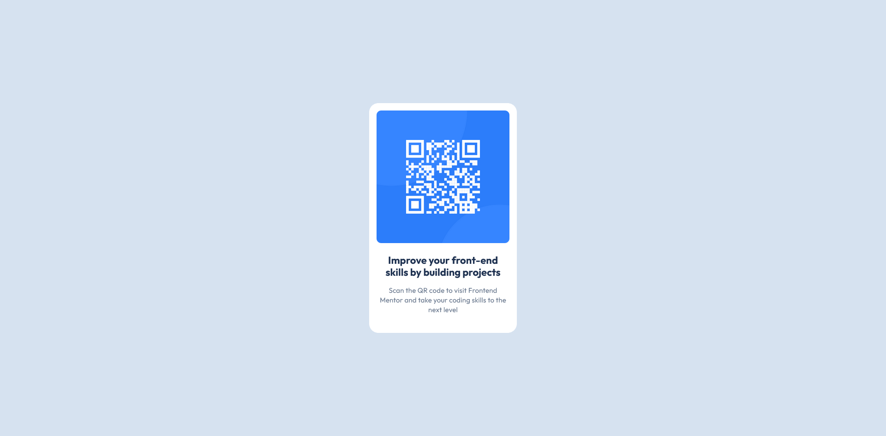

# Frontend Mentor - QR code component solution

This is a solution to the [QR code component challenge on Frontend Mentor](https://www.frontendmentor.io/challenges/qr-code-component-iux_sIO_H). Frontend Mentor challenges help you improve your coding skills by building realistic projects.

## Table of contents

- [Overview](#overview)
  - [Screenshot](#screenshot)
  - [Links](#links)
- [My process](#my-process)
  - [Built with](#built-with)
  - [What I learned](#what-i-learned)
- [Author](#author)

## Overview

### Screenshot

### Links

- Solution URL: [Github - QR code component](https://github.com/Sasa-Tausan/qr-code-component-main)
- Live Site URL: [Qr code component](https://sasa-qr-code-component.netlify.app/)

## My process

### Built with

- CSS custom properties
- Flexbox
- CSS Grid

### What I learned

I learned how to use CSS variables, how to implement basic CSS reset, how to center a card with display: grid

## Author

- Frontend Mentor - [@Sasa-Tausan](https://www.frontendmentor.io/profile/Sasa-Tausan)
